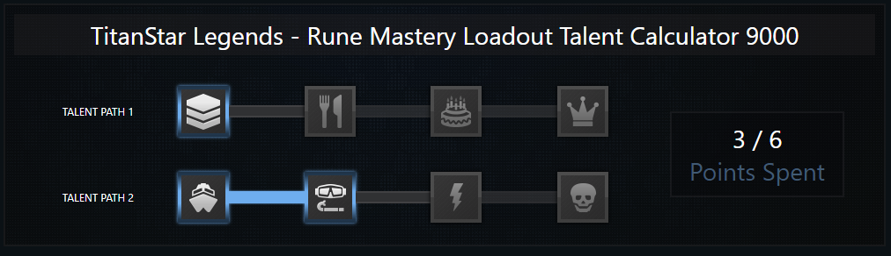
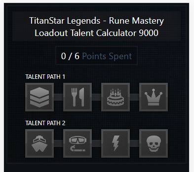
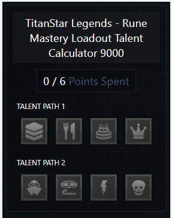

# Front-End Developer Challenge

Dependencies can be installed with `npm ci` and the app can be built and deployed using `npm run build`.

This challenge was built using:

- React and JavaScript
- SCSS (SASS)

## The Challenge

The challenge was to build a js application that would allow players to replicate in game loadouts with the following functionality.

- Users can spend up to 6 points on their loadout.
- Users will left click to buy a talent.
- Users will right click to remove a talent.
- Each talent only counts as a single point.
- Items must be selected in order.

Below is the mockup:

## Results

Here is a screenshot of the results of the challenge with all the functionality above implemented:

Along with functionality for the challenge, I focused my attention on a few other key areas.

### Fluid/Responsive Design

I wanted to make the app usable on both browsers and mobile devices.  Here is a screenshot from an iPhone.

You can see how the screen reorganizes to have the point display above the talent trees along with the spacing and size of the branches between the talents.
When the screen width is dropped to 300 pixels or less, we can see similar changes below.  The only difference is the branches are no longer displayed.

### Data Driven

#### Mocked Backend Service

In order to simulate the data coming from a backend service, a mock  data file was created in [`src\assets\mockdata\talentdata.json`](https://github.com/tynanr09/front-end-development-challenge/tree/main/src/assets/mockdata).

When a user first accesses the page the data is loaded from this file.  From here a user can add and remove talents as they see fit.  Upon each action the data is saved to the browsers local storage and will be retrieved from the local storage when users naviagte back to the page.  If the local storage is cleared, the data will be retrieve from the mock data file.

This logic is stored in the [`talentService.js`](https://github.com/tynanr09/front-end-development-challenge/tree/main/src/services) file.

#### Data Structure

With the mock data file mentioned above, we can make edits to the file in order to change how the talents are displayed.  We have three different data structures that allow us to change what is displayed from the frontend.

- Points
  - maxPoints: Determines the max amount of points a user can spend on the loadout.
  - currentPoints: The number of points the user has currently spent.

- Talent Tree
  - name:  Name of the talent tree.
  - sequence: Order of the talent trees to be displayed.  The trees can be defined in any order within an array, they will be dispayed on the frontend based on this value.
  - talents:  List of talents within the tree.

- Talent
  - name: Name of the talent.  Determines the icon to be displayed for the talent.  Currently it only supports the following values:
    - stack
    - silverware
    - cake
    - crown
    - boat
    - scuba
    - bolt
    - skull
  - sequence: Order of the talentss to be displayed.  The talents can be defined in any order within an array, they will be dispayed on the frontend based on this value.
  - active: Determines if the talent has been bought.

With this structure we can modify [`src\assets\mockdata\talentdata.json`](https://github.com/tynanr09/front-end-development-challenge/tree/main/src/assets/mockdata) and have our the application respond to the definition of the file.  

**Note:** You will need to clear the local storage if the changes have been made to [`src\assets\mockdata\talentdata.json`](https://github.com/tynanr09/front-end-development-challenge/tree/main/src/assets/mockdata) after accessing the application.
